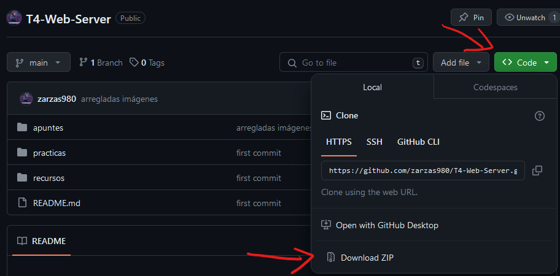
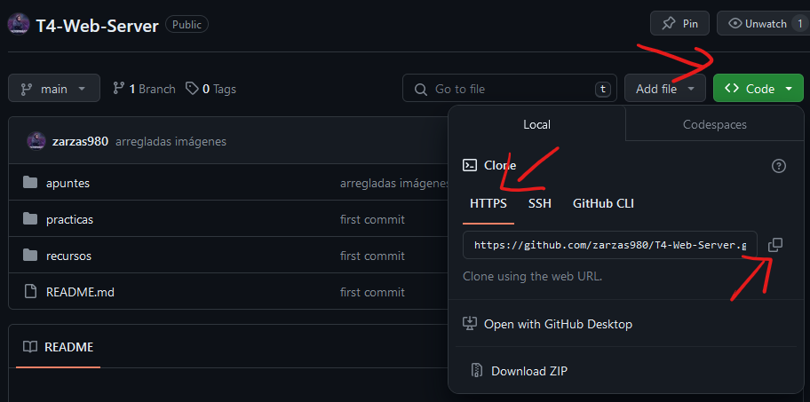

# Tema 4: Gestión de servidores Web. Apache.

Índice de contenidos del repositorio:

* [Apuntes](/apuntes/)
* [Práticas](/practicas)
* [Recursos](/recursos)

## ¿Cómo usar este repositorio?

Este repositorio contiene tanto los apuntes de teoría relacionados con el tema de servidor Apache como los ejercicios y práticas. Además, tambien contiene los materiales y recursos que se necesitan para realizar las práticas. Para descargar los contenidos des este repositorio tenéis varias opciones.

### Descarga manual

Puedes descargar todo el repositorio en formato `.zip` de forma muy sencilla simplemente haciendo click en el botón descargar como se ve en la imagen.



### Descarga mediante Git

También se puede descargar el repositori usando [Git](https://git-scm.com/). Este método es muy útil para importar los recursos necesarios para realizar los ejercicios y las práticas. Simplemente puedes seguir estos pasos en tu máquina virtual y obtendrás los archivos en tu servidor.

Lo primero que se necesita es tener el paquete de Git instalado:

```
sudo apt install git
```

Una vez instalado simplemente copias la URL del repositorio. 



Ahora navegas a la carpeta de tu sistema en la que quieras clonar el repositorio. Una vez que estás ahí ejectuas el comando:

```
git clone <URL del repositorio>
```
Esto clonará todo el repositorio a la carpeta actual incluyendo todo los archivos Markdown, arhivos `.zip`, etc.

Si deseas obtener solo los archivos `.html` y `.css` el proceso es diferente. Primero debes crear un repositorio vacío en tu equipo:
```
mkdir <repositorio>
cd <repositorio>
git init
```
Luego cargas el repositorio remoto
```
git remote add -f origin <URL del repositorio>
````
A continuación necesitas habilitar la opción sparse checkout para elegir que opciones se deben copiar.
```
git config core.sparseCheckout true
```

Luego se especifica que archivos se quieren importar incluyéndolos en el archivo `.git/info/sparse-checkout`
```
echo "*.html" >> .git/info/sparse-checkout
echo "*.css" >> .git/info/sparse-checkout
```
Por último actualizas el repositorio vacío con los datos del repositorio remoto
```
git pull origin main
```

Esto importará solo los archivos `.html` y `.css` repetanto el árbol de directorios del repositorio remoto.


